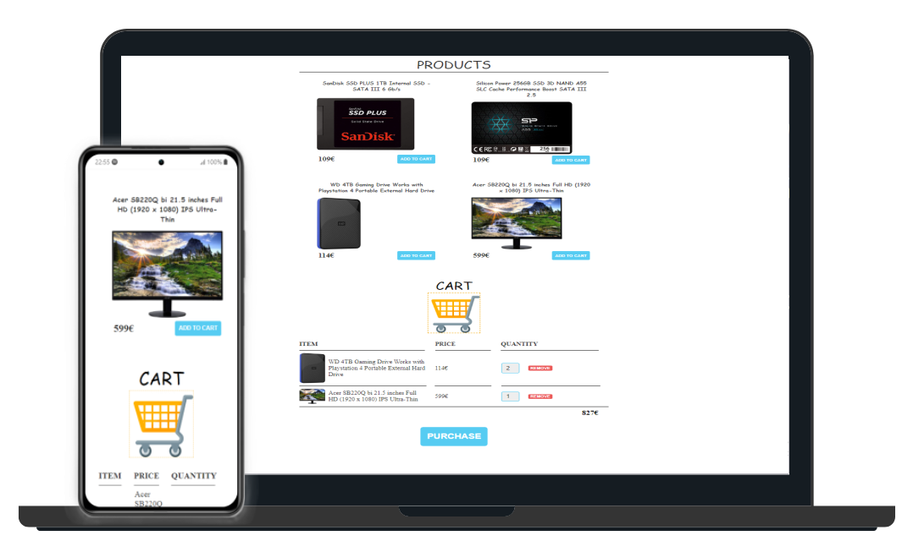

<<<<<<< HEAD

=======
# DRAG AND DROP - SHOPPING CART

***
>>>>>>> ramab
## TABLE OF CONTENTS

1. [Introduction](#introduction) :ok_hand:
2. [Tecnhologies](#tecnhologies) :floppy_disk:
2. [Getting started](#getting-started) :rocket:
3. [Launch](#launch)

***
### Introduction
<<<<<<< HEAD
This is the final project of the pre full-stack developer bootcamp of GeekHubs Academy.
=======
This is the final project of the GeekHubs Academy full-stack developer bootcamp.
>>>>>>> ramab
It consists of an HTML5 application that reads data from an open API. In this application the client can simulate a shopping cart where products can be added using the buttons or by dragging the image to the shopping cart.
***

### Tecnhologies
Technologies used within the project:
* HTML5
* CSS3
* JAVASCRIPT

***
### Getting-started
To ejecute this app you must have in your computer:
- Internet conexion
- Visual Studio Code
<<<<<<< HEAD
- Live Server Extension Installed in Visual Studio Code
- Git Hub repository

=======
- Git Hub repository
>>>>>>> ramab
***

### Launch
Finally, to launch and enjoy the aplication you should follow the following steps:
- Download the folder **PROYECTO** of my github profile [Fernando](https://github.com/Ferelbue/proyecto/tree/ramab).
<<<<<<< HEAD
- In visual studio code, select and do right click in the file *index.html*, and click in "Open with Live Server", and a Internet Browser window will be opened.

***

[Top of document](#table-of-contents)
=======
- Open the file *index.html* in visual studio code and ejecute it with live server.

***

[Top of document](#table-of-contents)
>>>>>>> ramab
